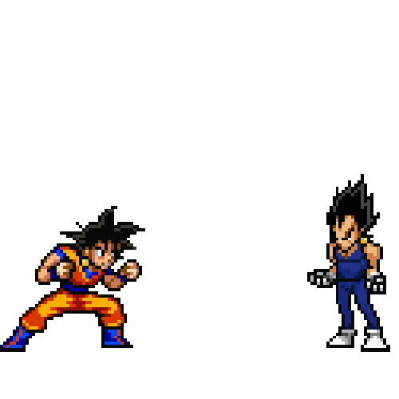

# Potara

<p align="center">
  
</p>

**Fuse your agent skills into one.**

Small skills are easy to write and easy to reason about. But real tasks often
need three of them at once, and running them one after another loses whatever
the combination was supposed to add. Potara merges skills into a single
capability that carries every input's instructions, scripts, references, and
triggers.

The name comes from the Potara earrings in Dragon Ball. That fusion does not
need the two people to be matched in power, and it holds together better than a
Fusion Dance.

## Install

### `npx skills` (any agent)

```
npx skills add ydrgzm/potara --skill potara
```

Global, no prompt:

```
npx skills add ydrgzm/potara --skill potara -g -y
```

### Claude Code plugin

```
/plugin marketplace add ydrgzm/potara
/plugin install potara@potara
```

## Why this exists

Skills do not compose on their own. Load `humanizer` and `no-ai-slop` together
and the agent holds two overlapping procedures with no rule for which one wins,
what order they run in, or how their two lists of "AI tells" combine. Potara
does that reconciliation as an explicit step. It removes duplicate steps, orders
the rest by data dependency, resolves clashes by specificity and then by
dominance, and carries every safety rule from every fusee into the result.

## Reference

| Skill | Invocation | Description |
|-------|-----------|-------------|
| [`potara`](skills/potara/SKILL.md) | Model-invoked | Fuse 2+ skills. Three modes: `potara` (runtime merge, ends with the session), `dance` (write a new merged skill folder), `namek` (one skill absorbs another in place, with a backup). |

### Modes

| Mode | What it does | Persistence |
|------|--------------|-------------|
| `potara` | merges the instructions in context for the current session | ends with the session |
| `dance` | writes a new merged skill folder with a portmanteau name | new folder on disk |
| `namek` | one skill absorbs another, rewritten in place, old copy saved as `SKILL.original.md` | permanent |

### Examples

These fusions use [`addyosmani/agent-skills`](https://github.com/addyosmani/agent-skills)
and [`mattpocock/skills`](https://github.com/mattpocock/skills). Full
walkthroughs are in [docs/fusions.md](docs/fusions.md).

| Fuse | Mode | What the fusion adds |
|------|------|----------------------|
| `diagnosing-bugs` + `debugging-and-error-recovery` + `tdd` | `potara` | one triage pass instead of two, and the fix arrives with a regression test |
| `spec-driven-development` + `to-spec` + `to-tickets` | `dance`, as `specforge` | a conversation becomes an ordered backlog in one call |
| `implement` + `incremental-implementation` + `code-review-and-quality` | `namek` | the implement skill gains a slice-size limit and a review rubric |
| `frontend-ui-engineering` + `performance-optimization` + `security-and-hardening` | `potara` | one review pass, and the trade-offs between the three become explicit questions |

## License

MIT. See [LICENSE](LICENSE).
